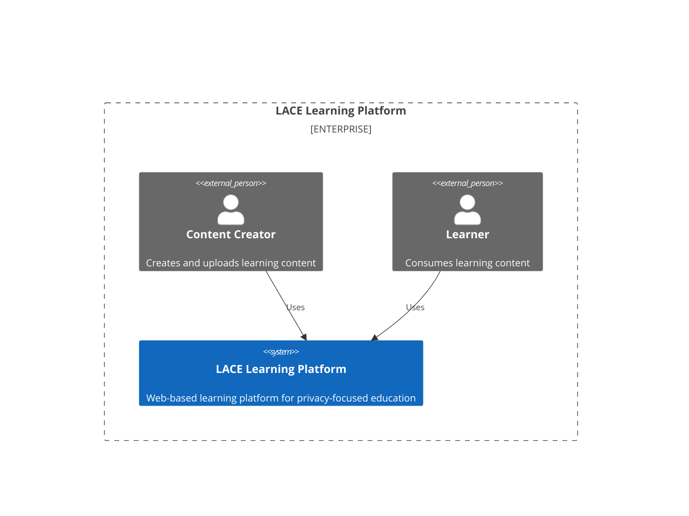
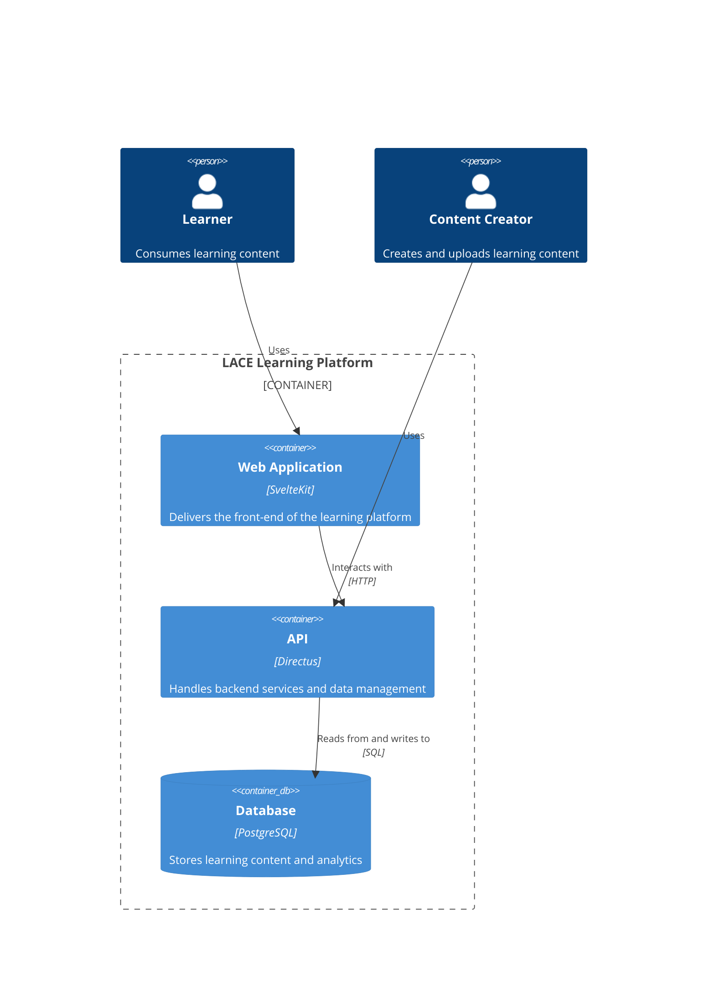

# LACE

## Features

## Development

### Architecture

#### Context

```mermaid
C4Context
    Enterprise_Boundary(b0, "LACE Learning Platform") {
        Person_Ext(contentCreator, "Content Creator", "Creates and uploads learning content")
        Person_Ext(learner, "Learner", "Consumes learning content")

        System(lace, "LACE Learning Platform", "Web-based learning platform for privacy-focused education")
    }

    Rel(contentCreator, lace, "Uses")
    Rel(learner, lace, "Uses")

    UpdateLayoutConfig($c4ShapeInRow="2", $c4BoundaryInRow="1")

```

#### Containers

```mermaid
C4Container

    Person(learner, "Learner", "Consumes learning content")
    Person(contentCreator, "Content Creator", "Creates and uploads learning content")

    Container_Boundary(lace, "LACE Learning Platform") {
        Container(webApp, "Web Application", "SvelteKit", "Delivers the front-end of the learning platform")
        Container(api, "API", "Directus", "Handles backend services and data management")
        ContainerDb(database, "Database", "PostgreSQL", "Stores learning content and analytics")
    }

    Rel(contentCreator, api, "Uses")
    Rel(learner, webApp, "Uses")
    Rel(webApp, api, "Interacts with", "HTTP")
    Rel(api, database, "Reads from and writes to", "SQL")

    UpdateLayoutConfig($c4ShapeInRow="2", $c4BoundaryInRow="2")
```

#### Component

```mermaid
C4Component
    title Component diagram for LACE Learning Platform - SvelteKit Application

    Container(api, "API", "Directus", "Handles backend services and data management")
    ContainerDb(database, "Database", "PostgreSQL", "Stores learning content and analytics")

    Container_Boundary(api, "Web Application") {

        Component(serviceProxy, "ProxyService", "TypeScript", "Handles proxy API integration")
        Component(serviceDirectus, "DirectusService", "TypeScript", "Handles Directus API integration")
        Component(serviceAnalytics, "AnalyticsService", "TypeScript", "Handles analytics API integration")
        Component(servicePreview, "PreviewService", "TypeScript", "Handles preview API integration")
        
        Component(pageHome, "HomePage", "Svelte", "Displays the home page with general information", $tags="page")
        Component(courseCardHome, "CourseCardHome", "Svelte", "Component to display individual courses on the home page")
        Component(layoutHome, "HomeLayout", "Svelte", "Layout for the home page")
        
        Component(layoutCourses, "CoursesLayout", "Svelte", "Layout for the course and courses page")
        Component(pageCourses, "CoursesPage", "Svelte", "Displays all available courses", $tags="page")
        Component(courseCard, "CourseCard", "Svelte", "Component to display individual courses")
        
        Component(pageCourse, "CoursePage", "Svelte", "Displays course content to learners", $tags="page")
        Component(chapterCard, "ChapterCard", "Svelte", "Component to display individual chapters")

        Component(progressStore, "ProgressStore", "Svelte Store", "Manages user progress state")
        
        Component(pageLearning, "LearningPage", "Svelte", "Displays learning content to learners", $tags="page")
        Component(chapterFinal, "ChapterFinal", "Svelte", "Component to display chapter final details")
        Component(mcQuiz, "McQuiz", "Svelte", "Multiple choice quiz component")
        Component(orderQuiz, "OrderQuiz", "Svelte", "Ordering quiz component")
        Component(layoutLearning, "LearningLayout", "Svelte", "Layout for the learning page")
        
        Component(errorBoundary, "ErrorBoundary", "Svelte", "Error boundary component")
        
        
        Rel(layoutHome, pageHome, "Renders")
        Rel(layoutCourses, pageCourses, "Renders")
        Rel(layoutCourses, pageCourse, "Renders")
        Rel(layoutLearning, pageLearning, "Renders")
        
        Rel(pageHome, courseCardHome, "Renders")
        Rel(pageCourses, courseCard, "Renders")
        Rel(pageCourse, chapterCard, "Renders")
        
        Rel(pageLearning, chapterFinal, "Renders")
        Rel(pageLearning, mcQuiz, "Renders")
        Rel(pageLearning, orderQuiz, "Renders")
        
        Rel(pageLearning, progressStore, "Uses")
        Rel(pageCourse, progressStore, "Uses")
        
        Rel(serviceDirectus, serviceProxy, "Uses")
        Rel(serviceAnalytics, serviceDirectus, "Uses")
        Rel(servicePreview, serviceDirectus, "Uses")
    }
    
    Rel_Back(api, serviceProxy, "Uses")
    
    Rel(api, database, "Reads from and writes to", "SQL")
    

    UpdateLayoutConfig($c4ShapeInRow="3", $c4BoundaryInRow="1")

```

#### Database

```mermaid
erDiagram
    Courses {
        text Description 
        uuid Image FK 
        character_varying Title 
        character_varying color 
        character_varying icon 
        uuid id PK 
        character_varying status 
    }

    certificates {
        timestamp_with_time_zone date_created 
        uuid id PK 
        character_varying signature 
    }

    certification {
        timestamp_with_time_zone date_updated 
        character_varying details_form_description 
        character_varying details_form_title 
        uuid id PK 
        uuid user_updated FK 
    }

    course_page {
        timestamp_with_time_zone date_updated 
        uuid id PK 
        character_varying status 
        character_varying title 
        uuid user_updated FK 
    }

    courses_page {
        character_varying Toast_text 
        timestamp_with_time_zone date_updated 
        uuid id PK 
        character_varying status 
        character_varying title 
        uuid user_updated FK 
    }

    folien {
        uuid bild FK 
        timestamp_with_time_zone date_created 
        timestamp_with_time_zone date_updated 
        uuid id PK 
        integer sort 
        character_varying status 
        uuid user_created FK 
        uuid user_updated FK 
    }

    ip2city {
        character_varying city_name 
        character_varying continent_code 
        character_varying country_iso 
        character_varying first_ip 
        bigint first_ip_int 
        uuid id PK 
        character_varying last_ip 
        bigint last_ip_int 
        real latitude 
        real longitude 
        character_varying state_name 
    }

    kapitel {
        character_varying color 
        timestamp_with_time_zone date_created 
        timestamp_with_time_zone date_updated 
        text description 
        uuid id PK 
        uuid kurs FK 
        uuid parent FK 
        integer sort 
        character_varying status 
        character_varying title 
        uuid user_created FK 
        uuid user_updated FK 
    }

    kapitel_content_1 {
        character_varying collection 
        integer id PK 
        character_varying item 
        uuid kapitel_id FK 
        integer sort 
    }

    landing {
        character_varying courses_action_button_text 
        text courses_description 
        character_varying courses_title 
        timestamp_with_time_zone date_updated 
        character_varying description 
        uuid id PK 
        character_varying status 
        character_varying subtitle 
        character_varying title 
        uuid user_updated FK 
    }

    learning_page {
        timestamp_with_time_zone date_updated 
        character_varying final_text 
        character_varying final_title 
        uuid id PK 
        character_varying status 
        uuid user_updated FK 
    }

    mcQuiz {
        json answers 
        timestamp_with_time_zone date_created 
        timestamp_with_time_zone date_updated 
        uuid id PK 
        character_varying question 
        integer sort 
        character_varying status 
        character_varying type 
        uuid user_created FK 
        uuid user_updated FK 
    }

    page_views {
        character_varying browser 
        timestamp_with_time_zone date_created 
        character_varying device 
        uuid id PK 
        character_varying ip 
        geometry location_point 
        character_varying os 
        character_varying path 
        character_varying referrer 
    }

    quiz_data {
        boolean correct 
        timestamp_with_time_zone date_created 
        uuid id PK 
        uuid quiz FK 
        json wrong 
    }

    survey {
        timestamp_with_time_zone date_created 
        timestamp_with_time_zone date_updated 
        character_varying description 
        uuid id PK 
        json questions 
        character_varying status 
        character_varying submit_button 
        character_varying title 
        character_varying trigger_button 
        uuid user_created FK 
        uuid user_updated FK 
    }

    survey_data {
        json answers 
        timestamp_with_time_zone date_created 
        uuid id PK 
    }

    kapitel }o--|| Courses : "kurs"
    kapitel }o--|| kapitel : "parent"
    kapitel_content_1 }o--|| kapitel : "kapitel_id"
    quiz_data }o--|| mcQuiz : "quiz"

```
