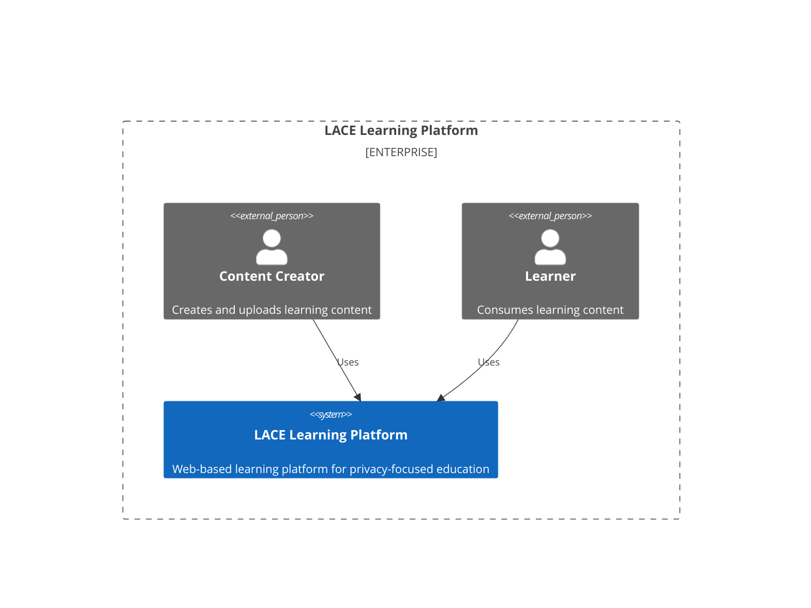
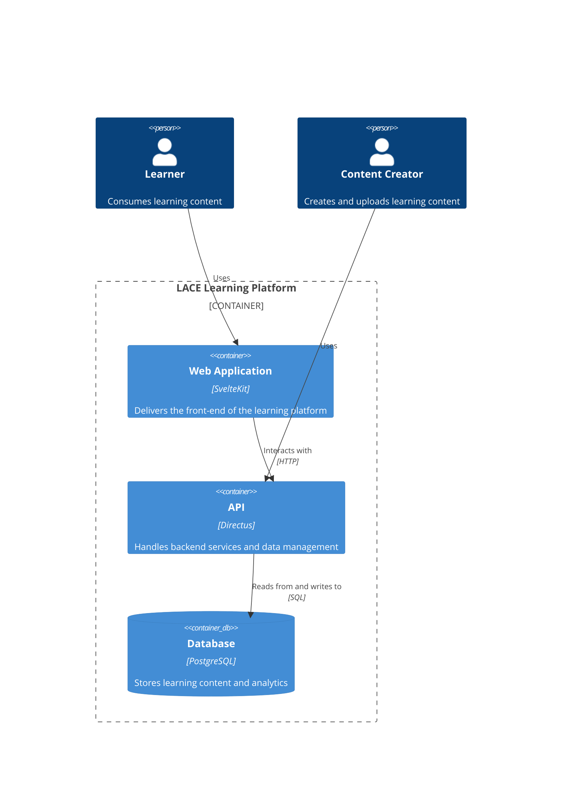

# LACE

[](https://github.com/H3nkl3r/LACE/actions/workflows/build.yml)
[](https://github.com/H3nkl3r/LACE/actions/workflows/playwright.yml)

LACE is a web-based learning platform that offers courses on Privacy-Enhancing Technologies. The platform aims to provide high-quality educational content to non-technical practitioners, managers, and legal professionals interested in privacy-focused technologies. LACE offers a range of courses, including introductory courses, advanced courses, and specialized courses on various topics related to Privacy-Enhancing Technologies.

## Features

* [X] 🚀 **Landing Page**: A modern and professional landing page that showcases the LACE Learning Platform and its courses.
* [X] 📚 **Courses Overview**: A page that displays all available courses with detailed information and a "Learn More" button.
* [X] 📖 **Course Detail Page**: A detailed page for each course that includes a course image, title, and content outline.
* [X] 💻 **Learning Page**: A page that displays the learning content for each course, including modules, quizzes, and progress tracking.
* [X] 📱 **Responsive Design**: A responsive design that adapts to different screen sizes and devices for optimal user experience.
* [X] 🎓 **Certification**: A certification feature that allows users to earn certificates upon course completion.
* [X] 🔍 **Verification**: A verification feature that allows users to verify the authenticity of certificates using a signature.
* [X] 📊 **Analytics**: An analytics feature that tracks user progress and provides insights into course engagement.
* [X] 💬 **Feedback**: A feedback feature that allows users to provide feedback on courses and the learning platform.
* [X] 🔄 **Device Switching**: A device switching feature that allows users to seamlessly switch between devices while learning.
* [X] 🛠️ **Content Management System Integration**: Integration with a content management system (Directus) for managing learning content.
* [X] 👁️ **Preview Mode**: A preview mode that allows content managers to preview course content before enrolling.
* [X] 📊 **Admin Dashboard**: An admin dashboard that allows content managers to manage courses, and analytics.
* [ ] 🔍 **Search Functionality**: A search functionality that allows users to search for specific courses or content.
* [ ] 📤 **Social Sharing**: A social sharing feature that allows users to share courses and certificates on social media platforms.
* [ ] 🏆 **Gamification**: A gamification feature that includes badges, points, and leaderboards to motivate and engage learners.
* [ ] 🔔 **Notifications**: A notifications feature that sends reminders, updates, and announcements to users.
* [ ] 🎨 **Customization**: A customization feature that allows users to personalize their learning experience. Large language models could be used for this purpose.

## Development

### Design decisions
#### Landing Page

##### Title and Header:
The title is concise and action-oriented, clearly conveying the page's purpose. The header features a gradient background and the LACE logo, creating a modern, professional appearance and establishing brand identity. This creates a strong first impression and reinforces the brand's credibility.

##### Courses Section:
Three courses target different user groups: non-technical practitioners, managers, and legal professionals. Each course is presented as a card with a title, short description, and a "Learn More" button, allowing easy scanning and quick access to relevant information. The card layout enhances user experience by facilitating quick scanning and easy interaction.

##### Publications Section:
Scientific publications are listed vertically with icons for easy identification, ensuring a simple and intuitive browsing experience. Listing key scientific publications provides access to credible sources, establishing trust and authority.

##### Footer Section:
The footer includes branding, relevant links, sponsor information, and a copyright notice. The consistent color scheme and fonts ensure a cohesive look. Including branding and sponsor information adds legitimacy and transparency, while relevant links improve navigation and access to additional resources.

#### Courses Overview

##### Course Cards:
All courses are presented as expandable cards with a course image, title, and detailed content outline. This design allows users to quickly identify and expand each course for more detailed information, enhancing the user experience through easy navigation.

##### Navigation:
Breadcrumb navigation is included at the top of the page to help users easily navigate back to the main courses page or other sections of the website. This improves the overall user experience by making navigation intuitive and straightforward.

#### Course Detail Page

##### Consistent Layout:
All courses are displayed using a consistent card-based layout to ensure a uniform look and feel across different courses.

##### Navigation:
Breadcrumb navigation is included at the top of the page to help users easily navigate back to the main courses page or other sections of the website. This improves the overall user experience by making navigation intuitive and straightforward.

##### Adaptability:
The design is adaptable to accommodate different courses. While the basic layout remains consistent, the specific content and number of modules can vary based on the course requirements. This flexibility ensures that the design can cater to a wide range of topics within the realm of Privacy-Enhancing Technologies.

#### Learning Page

##### Sidebar Navigation:
A sidebar displays the course title, progress bar, and module list. This design keeps navigation intuitive and accessible, allowing users to track their progress and easily switch between modules.

##### Progress Tracking:
The progress bar visually represents the user's completion percentage, motivating them to continue and complete the course.

##### Module Expansion:
Modules are presented as expandable sections. When clicked, they reveal detailed content such as definitions, benefits, applications, and quizzes. This keeps the interface clean and prevents information overload.

##### Interactive Elements:
Buttons for "Give Feedback" and "Switch Device" are included to enhance user interaction and flexibility. These options allow users to provide input on the course and switch devices seamlessly.

### Architecture

#### Context



#### Containers



#### Component

```mermaid
C4Component
    title Component diagram for LACE Learning Platform - SvelteKit Application

    Container(api, "API", "Directus", "Handles backend services and data management")
    ContainerDb(database, "Database", "PostgreSQL", "Stores learning content and analytics")

    Container_Boundary(api, "Web Application") {

        Component(serviceProxy, "ProxyService", "TypeScript", "Handles proxy API integration")
        Component(serviceDirectus, "DirectusService", "TypeScript", "Handles Directus API integration")
        Component(serviceAnalytics, "AnalyticsService", "TypeScript", "Handles analytics API integration")
        Component(servicePreview, "PreviewService", "TypeScript", "Handles preview API integration")
        
        Component(pageHome, "HomePage", "Svelte", "Displays the home page with general information", $tags="page")
        Component(courseCardHome, "CourseCardHome", "Svelte", "Component to display individual courses on the home page")
        Component(layoutHome, "HomeLayout", "Svelte", "Layout for the home page")
        
        Component(layoutCourses, "CoursesLayout", "Svelte", "Layout for the course and courses page")
        Component(pageCourses, "CoursesPage", "Svelte", "Displays all available courses", $tags="page")
        Component(courseCard, "CourseCard", "Svelte", "Component to display individual courses")
        
        Component(pageCourse, "CoursePage", "Svelte", "Displays course content to learners", $tags="page")
        Component(chapterCard, "ChapterCard", "Svelte", "Component to display individual chapters")

        Component(progressStore, "ProgressStore", "Svelte Store", "Manages user progress state")
        
        Component(pageLearning, "LearningPage", "Svelte", "Displays learning content to learners", $tags="page")
        Component(chapterFinal, "ChapterFinal", "Svelte", "Component to display chapter final details")
        Component(mcQuiz, "McQuiz", "Svelte", "Multiple choice quiz component")
        Component(orderQuiz, "OrderQuiz", "Svelte", "Ordering quiz component")
        Component(layoutLearning, "LearningLayout", "Svelte", "Layout for the learning page")
        
        Component(errorBoundary, "ErrorBoundary", "Svelte", "Error boundary component")
        
        
        Rel(layoutHome, pageHome, "Renders")
        Rel(layoutCourses, pageCourses, "Renders")
        Rel(layoutCourses, pageCourse, "Renders")
        Rel(layoutLearning, pageLearning, "Renders")
        
        Rel(pageHome, courseCardHome, "Renders")
        Rel(pageCourses, courseCard, "Renders")
        Rel(pageCourse, chapterCard, "Renders")
        
        Rel(pageLearning, chapterFinal, "Renders")
        Rel(pageLearning, mcQuiz, "Renders")
        Rel(pageLearning, orderQuiz, "Renders")
        
        Rel(pageLearning, progressStore, "Uses")
        Rel(pageCourse, progressStore, "Uses")
        
        Rel(serviceDirectus, serviceProxy, "Uses")
        Rel(serviceAnalytics, serviceDirectus, "Uses")
        Rel(servicePreview, serviceDirectus, "Uses")
    }
    
    Rel_Back(api, serviceProxy, "Uses")
    
    Rel(api, database, "Reads from and writes to", "SQL")
    

    UpdateLayoutConfig($c4ShapeInRow="3", $c4BoundaryInRow="1")

```



#### Database

```mermaid
erDiagram
    Courses {
        text Description 
        uuid Image FK 
        character_varying Title 
        character_varying color 
        character_varying icon 
        uuid id PK 
        character_varying status 
    }

    certificates {
        timestamp_with_time_zone date_created 
        uuid id PK 
        character_varying signature 
    }

    certification {
        timestamp_with_time_zone date_updated 
        character_varying details_form_description 
        character_varying details_form_title 
        uuid id PK 
        uuid user_updated FK 
    }

    course_page {
        timestamp_with_time_zone date_updated 
        uuid id PK 
        character_varying status 
        character_varying title 
        uuid user_updated FK 
    }

    courses_page {
        character_varying Toast_text 
        timestamp_with_time_zone date_updated 
        uuid id PK 
        character_varying status 
        character_varying title 
        uuid user_updated FK 
    }

    folien {
        uuid bild FK 
        timestamp_with_time_zone date_created 
        timestamp_with_time_zone date_updated 
        uuid id PK 
        integer sort 
        character_varying status 
        uuid user_created FK 
        uuid user_updated FK 
    }

    ip2city {
        character_varying city_name 
        character_varying continent_code 
        character_varying country_iso 
        character_varying first_ip 
        bigint first_ip_int 
        uuid id PK 
        character_varying last_ip 
        bigint last_ip_int 
        real latitude 
        real longitude 
        character_varying state_name 
    }

    kapitel {
        character_varying color 
        timestamp_with_time_zone date_created 
        timestamp_with_time_zone date_updated 
        text description 
        uuid id PK 
        uuid kurs FK 
        uuid parent FK 
        integer sort 
        character_varying status 
        character_varying title 
        uuid user_created FK 
        uuid user_updated FK 
    }

    kapitel_content_1 {
        character_varying collection 
        integer id PK 
        character_varying item 
        uuid kapitel_id FK 
        integer sort 
    }

    landing {
        character_varying courses_action_button_text 
        text courses_description 
        character_varying courses_title 
        timestamp_with_time_zone date_updated 
        character_varying description 
        uuid id PK 
        character_varying status 
        character_varying subtitle 
        character_varying title 
        uuid user_updated FK 
    }

    learning_page {
        timestamp_with_time_zone date_updated 
        character_varying final_text 
        character_varying final_title 
        uuid id PK 
        character_varying status 
        uuid user_updated FK 
    }

    mcQuiz {
        json answers 
        timestamp_with_time_zone date_created 
        timestamp_with_time_zone date_updated 
        uuid id PK 
        character_varying question 
        integer sort 
        character_varying status 
        character_varying type 
        uuid user_created FK 
        uuid user_updated FK 
    }

    page_views {
        character_varying browser 
        timestamp_with_time_zone date_created 
        character_varying device 
        uuid id PK 
        character_varying ip 
        geometry location_point 
        character_varying os 
        character_varying path 
        character_varying referrer 
    }

    quiz_data {
        boolean correct 
        timestamp_with_time_zone date_created 
        uuid id PK 
        uuid quiz FK 
        json wrong 
    }

    survey {
        timestamp_with_time_zone date_created 
        timestamp_with_time_zone date_updated 
        character_varying description 
        uuid id PK 
        json questions 
        character_varying status 
        character_varying submit_button 
        character_varying title 
        character_varying trigger_button 
        uuid user_created FK 
        uuid user_updated FK 
    }

    survey_data {
        json answers 
        timestamp_with_time_zone date_created 
        uuid id PK 
    }

    kapitel }o--|| Courses : "kurs"
    kapitel }o--|| kapitel : "parent"
    kapitel_content_1 }o--|| kapitel : "kapitel_id"
    quiz_data }o--|| mcQuiz : "quiz"

```



### Security

```bash
semgrep scan --config auto
```

### Quality

```bash
cd web
sudo codeclimate analyze
```

#### Good example of SvelteKit code:
- https://github.com/sveltejs/realworld

#### Analyzing bundle size
Need to remove the comment in the `vite.config.ts` file.
```bash 
cd web
npm run build
open ./svelte-kit/adapter-node/stats.html
```
