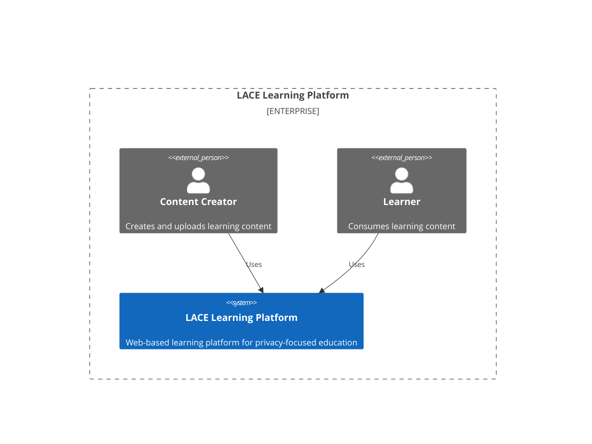
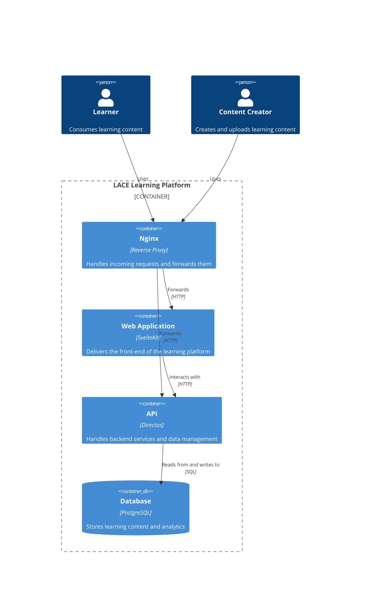

# LACE

[](https://github.com/H3nkl3r/LACE/actions/workflows/build.yml)
[](https://github.com/H3nkl3r/LACE/actions/workflows/playwright.yml)

LACE is a web-based learning platform that offers courses on Privacy-Enhancing Technologies. The platform aims to provide high-quality educational content to non-technical practitioners, managers, and legal professionals interested in privacy-focused technologies. LACE offers a range of courses, including introductory, advanced, and specialized courses on various topics related to Privacy-Enhancing Technologies.

## Features

* [X] 🚀 **Landing Page**: A modern and professional landing page that showcases the LACE Learning Platform and its courses.
* [X] 📚 **Courses Overview**: A page that displays all available courses with detailed information and a "Learn More" button.
* [X] 📖 **Course Detail Page**: A detailed page for each course that includes a course image, title, and content outline.
* [X] 💻 **Learning Page**: A page that displays the learning content for each course, including modules, quizzes, and progress tracking.
* [X] 📱 **Responsive Design**: A responsive design that adapts to different screen sizes and devices for optimal user experience.
* [X] 🎓 **Certification**: A certification feature that allows users to earn certificates upon course completion.
* [X] 🔍 **Verification**: A verification feature that allows users to verify the authenticity of certificates using a signature.
* [X] 📊 **Analytics**: An analytics feature that tracks user progress and provides insights into course engagement.
* [X] 💬 **Feedback**: A feedback feature that allows users to provide feedback on courses and the learning platform.
* [X] 🔄 **Device Switching**: A device switching feature that allows users to seamlessly switch between devices while learning.
* [X] 🛠️ **Content Management System Integration**: Integration with a content management system (Directus) for managing learning content.
* [X] 👁️ **Preview Mode**: A preview mode that allows content managers to preview course content before enrolling.
* [X] 📊 **Admin Dashboard**: An admin dashboard that allows content managers to manage courses and analytics.
* [X] 📤 **Social Sharing**: A social sharing feature that allows users to share courses and certificates on social media platforms.
* [ ] 🔍 **Search Functionality**: A search functionality that allows users to search for specific courses or content.
* [ ] 🏆 **Gamification**: A gamification feature that includes badges, points, and leaderboards to motivate and engage learners.
* [ ] 🔔 **Notifications**: A notifications feature that sends users reminders, updates, and announcements.
* [ ] 🎨 **Customization**: A customization feature that allows users to personalize their learning experience. Large language models could be used for this purpose.

## Development

### Design decisions
#### Landing Page

##### Title and Header:
The title is concise and action-oriented, clearly conveying the page's purpose. The header features a gradient background and the LACE logo, creating a modern, professional appearance and establishing brand identity. This creates a strong first impression and reinforces the brand's credibility.

##### Courses Section:
Three courses target different user groups: non-technical practitioners, managers, and legal professionals. Each course is presented as a card with a title, a short description, and a "Learn More" button, allowing easy scanning and quick access to relevant information. The card layout enhances user experience by facilitating quick scanning and easy interaction.

##### Publications Section:
Scientific publications are listed vertically with icons for easy identification, ensuring a simple and intuitive browsing experience. Listing key scientific publications provides access to credible sources, establishing trust and authority.

##### Footer Section:
The footer includes branding, relevant links, sponsor information, and a copyright notice. The consistent colour scheme and fonts ensure a cohesive look. Including branding and sponsor information adds legitimacy and transparency, while relevant links improve navigation and access to additional resources.

#### Courses Overview

##### Course Cards:
All courses are presented as expandable cards with a course image, title, and detailed content outline. This design allows users to quickly identify and expand each course for more detailed information, enhancing the user experience through easy navigation.

##### Navigation:
Breadcrumb navigation is included at the top of the page to help users easily navigate back to the main courses page or other sections of the website. This improves the overall user experience by making navigation intuitive and straightforward.

#### Course Detail Page

##### Consistent Layout:
All courses are displayed using a consistent card-based layout to ensure a uniform look and feel across different courses.

##### Navigation:
Breadcrumb navigation is included at the top of the page to help users easily navigate back to the main courses page or other sections of the website. This improves the overall user experience by making navigation intuitive and straightforward.

##### Adaptability:
The design is adaptable to accommodate different courses. While the basic layout remains consistent, the specific content and number of modules can vary based on the course requirements. This flexibility ensures that the design can cater to a wide range of topics within the realm of Privacy-Enhancing Technologies.

#### Learning Page

##### Sidebar Navigation:
A sidebar displays the course title, progress bar, and module list. This design keeps navigation intuitive and accessible, allowing users to track their progress and easily switch between modules.

##### Progress Tracking:
The progress bar visually represents the user's completion percentage, motivating them to continue and complete the course.

##### Module Expansion:
Modules are presented as expandable sections. When clicked, they reveal detailed content such as definitions, benefits, applications, and quizzes. This keeps the interface clean and prevents information overload.

##### Interactive Elements:
Buttons for "Give Feedback" and "Switch Device" are included to enhance user interaction and flexibility. These options allow users to provide input on the course and switch devices seamlessly.

### Architecture

#### Context



#### Containers



#### Database


### Security

```bash
semgrep scan --config auto
```

```bash
sudo docker pull zaproxy/zap-stable
sudo docker run -u zap -p 8080:8080 -p 8090:8090 -i zaproxy/zap-stable zap-webswing.sh
```

## Deployment

We use Docker Compose for developing and production deployment. The `docker-compose.yml` file defines the services and configurations for the LACE Learning Platform. The services include the web application, API, and database. The `Dockerfile` and `Dockerfile.dev` files define the build instructions for the web application container. Use `docker-compose.dev.yml` for development and `docker-compose.yml` for production deployment.

Each of our services lives in a separate directory:
* `web`: Contains the SvelteKit web application.
* `cms`: Contains the Directus Schema
* `reverse-proxy`: Contains the Nginx reverse proxy configuration.

If you are running the composition for the first time you will need to import the database schema. You can do this by running the following command:
```bash
sudo docker compose cp ~/cms/snapshot.yaml cms:/directus/snapshot.yaml
sudo docker compose exec -it cms npx directus schema snapshot apply --yes ./snapshot.yaml
```
After this you need to fill in some initial data and create a user with the rights tp access the content. After this export the token of the user and replace the environment variable.
```bash
docker compose -f docker-compose.dev.yml up
```